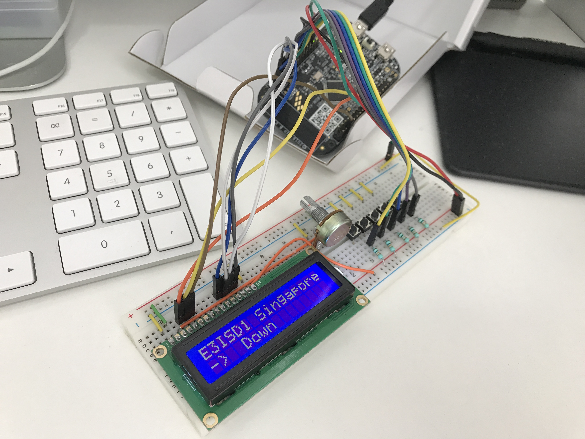

# E3ISD1: Exercises week 37
This exercise demonstrates how to
* Set up registers
* Connect and control a 16x2 LCD
* Read 5 buttons to control both on-board RGB LED and the LCD.

## Picture
The picture shows the setup running.

